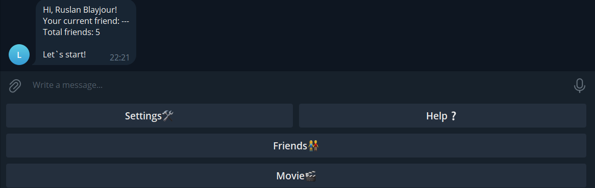
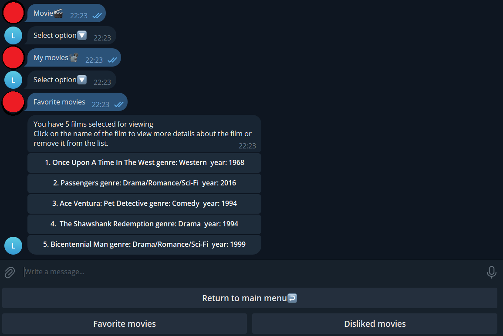
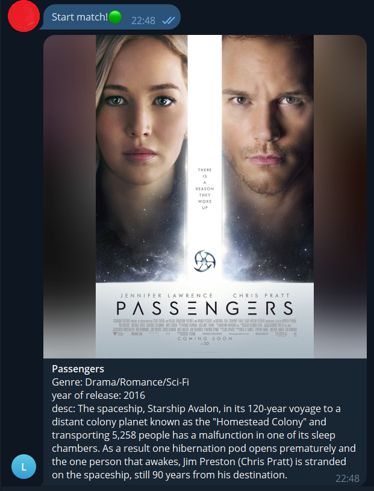
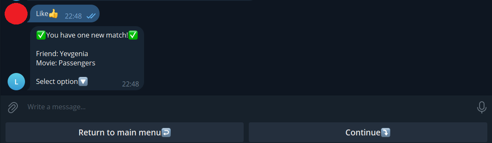
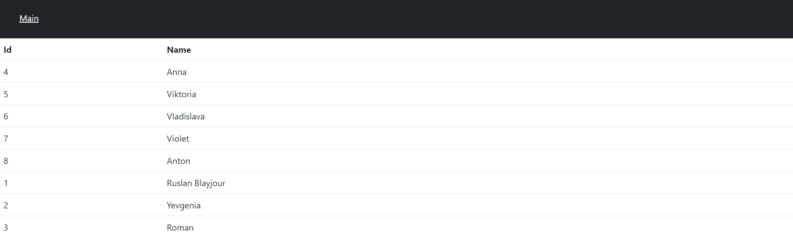
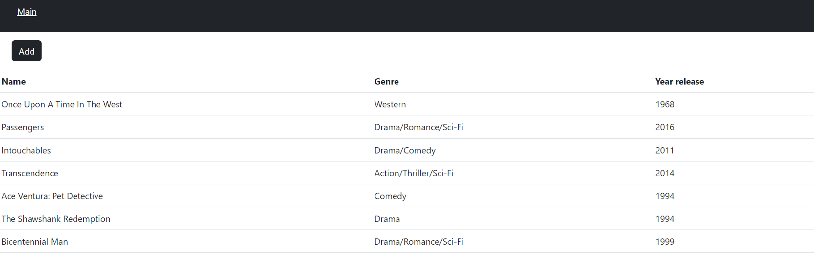
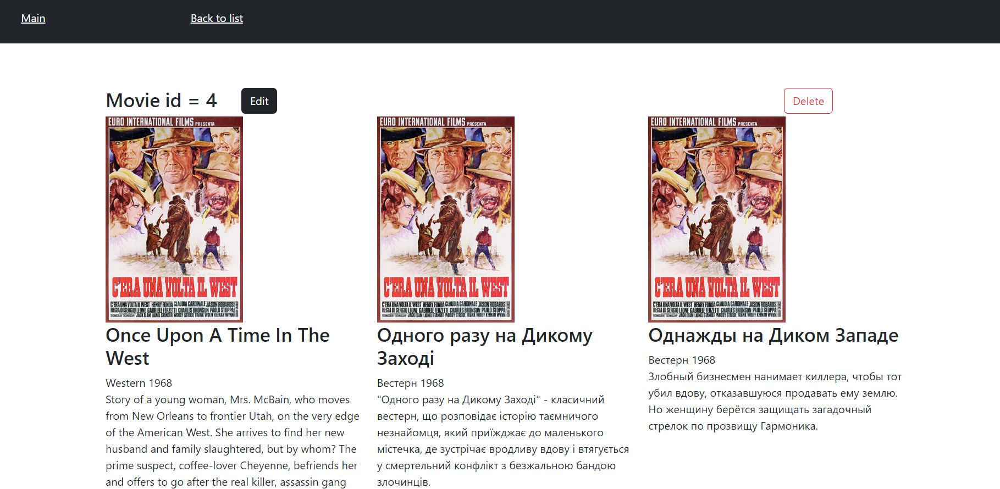

# Move Match
Telegram movie search bot for couples and friends

## Start to use
1. Setup and run application
2. Login to the admin panel using a web browser
3. Add movies to search with friends
4. Share the link to your bot with your friends
5. Add friends via bot using the generated key
6. Start Movie Match!

## Setup
1. Install a relational DBMS (PostgreSQL, MySQL, SQLite, etc)
2. Create database and
3. Paste the schema from the file src/main/resources\sql/schema.sql
4. Run application

## Telegram bot interface
+ ### Start

+ ### Movie menu

+ ### Match menu

+ ### Match result

## Web interface
+ ### Main page

+ ### Users page

+ ### Movies page

+ ### Movie edit page

